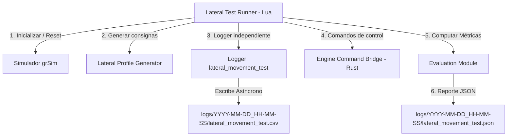

# Especificación de la Prueba de Movimiento Lateral (Lateral Movement Test)

* **Autor**: Marco Repetto
* **Fecha**: 17 de Julio de 2026
* **Estado**: Implementado
* **Versión**: 1.0.0

---

## 2. Introducción y Contexto

Un pilar fundamental para los robots omnidireccionales en la categoría Small Size League (SSL) es la capacidad de desplazarse rápidamente en cualquier dirección sin alterar su orientación global. El movimiento lateral puro (*strafing*) consiste en trasladarse perpendicularmente a la orientación del robot (a lo largo de su eje Y local).

Dado que este movimiento requiere una sincronización precisa de las velocidades angulares de todos los motores (generalmente cuatro ruedas omnidireccionales desfasadas a ángulos específicos como $\pm 45^\circ$ y $\pm 135^\circ$), pequeños desajustes en el acoplamiento cinemático, fricción desigual en las ruedas o fallos en el control PID del motor provocan desviaciones o deriva en el eje longitudinal (eje X local) o rotaciones involuntarias.

Para garantizar la estabilidad y calibrar el acoplamiento dinámico, esta especificación define una **prueba automatizada de movimiento lateral**. A diferencia de los tests de seguimiento generales, esta prueba registrará los datos de telemetría en un archivo de log específico e independiente (`lateral_movement_test.csv` / `lateral_movement_test.json`), facilitando el análisis aislado del comportamiento del hardware y controladores ante movimientos laterales puros.

---

## 3. Requerimientos Funcionales

El sistema de pruebas de movimiento lateral debe cumplir con los siguientes requerimientos funcionales:

* **RF-1: Generación de Perfil de Movimiento Lateral Puro**:
  * El sistema debe generar una consigna de movimiento que obligue al robot a desplazarse lateralmente a lo largo de su eje Y local.
  * Se deben soportar dos tipos de trayectorias laterales:
    * **Paso Lateral Lineal**: Desplazamiento de ida y vuelta continuo a velocidad fija (ej. de $-1.5$m a $+1.5$m en el eje Y local).
    * **Escalón Lateral / Ráfagas**: Movimiento con aceleración y desaceleración rápida (perfil trapezoidal de velocidad) para evaluar la respuesta transitoria y frenado lateral.
* **RF-2: Posicionamiento Inicial Automático**:
  * Antes de arrancar la prueba, el robot se debe posicionar en las coordenadas de partida ($x_0, y_0, \theta_0$) con velocidad cero.
  * La orientación inicial $\theta_0$ debe ser fija (normalmente $0$ o $\pi/2$ radianes) para simplificar la lectura física, y el robot debe intentar mantenerla constante durante todo el recorrido.
  * Se utilizará teleportación del simulador (`grsim`) para asegurar un estado inicial libre de inercias.
* **RF-3: Registro en Archivo de Log Específico**:
  * Los datos de telemetría de esta prueba deben grabarse de manera exclusiva e independiente en un archivo de log llamado `lateral_movement_test.csv` y sus metadatos/métricas en `lateral_movement_test.json`.
  * La prueba debe instanciar un logger modular independiente (`is_main = true`) con el nombre `"lateral_movement_test"`. Esto evitará mezclar o sobreescribir el log base `"system_log"` u otros tests del suite general.
* **RF-4: Variables a Registrar**:
  * En cada tick de control (60 Hz), se debe registrar en `lateral_movement_test.csv`:
    * `elapsed_time`: Tiempo transcurrido de la prueba (segundos).
    * `ref_x`, `ref_y`, `ref_theta`: Posiciones y orientación de referencia en coordenadas globales.
    * `act_x`, `act_y`, `act_theta`: Posición y orientación real del robot (visión/simulador).
    * `drift_x`: Error acumulado en el eje X local (deriva longitudinal durante el movimiento lateral).
    * `err_y`: Error de posición en el eje Y local.
    * `err_theta`: Error de orientación ($\theta_{ref} - \theta_{act}$).
    * `cmd_vx`, `cmd_vy`, `cmd_w`: Comandos de velocidad local enviados.
* **RF-5: Cálculo de Métricas Estadísticas**:
  * Al finalizar el recorrido, el sistema computará y guardará en `lateral_movement_test.json`:
    * **RMSE** y **MAE** del error lateral (eje Y local).
    * **Deriva Máxima (Max Drift X)**: Desviación absoluta máxima en el eje X local.
    * **RMSE** y **MAE** del error de orientación.
    * **Tiempo total de ejecución** y veredicto.
* **RF-6: Criterios de Aceptación y Veredicto**:
  * La prueba se considerará aprobada (`PASS`) si se cumplen de forma conjunta los siguientes umbrales configurables:
    * $RMSE_y \le 0.04$ m.
    * $MaxDrift_x \le 0.05$ m.
    * $RMSE_\theta \le 0.08$ rad.
    * Si alguna métrica sobrepasa su umbral o ocurre un timeout, la prueba fallará (`FAIL`).

---

## 4. Requerimientos No Funcionales

* **RNF-1: Frecuencia y Sincronismo**:
  * La evaluación de errores y el cálculo de la cinemática deben ocurrir de forma síncrona en el hilo de ejecución a 60 Hz.
* **RNF-2: Registro No Bloqueante**:
  * La persistencia de datos en los archivos de log independientes (`lateral_movement_test.csv` y `lateral_movement_test.json`) debe ser procesada asíncronamente por el File Writer en segundo plano.
* **RNF-3: Repetibilidad del Entorno**:
  * El simulador debe garantizar la remoción de fuerzas residuales en el robot mediante un comando de reset de inercia y teleportación antes de iniciar.

---

## 5. Arquitectura y Diseño Detallado

### 5.1 Componentes del Sistema

El flujo y los componentes involucrados en la prueba de movimiento lateral se representan en el siguiente diagrama:



1. **Lateral Profile Generator (`lateral_movement_generator.lua`)**: Calcula los puntos de referencia $y_{ref}$ y $v_{y\_ref}$ para el desplazamiento en el eje local del robot.
2. **Logger (`logger.rs` / Lua Bridge)**: Instanciado como un logger principal (`is_main = true`) con el nombre `"lateral_movement_test"`. Esto crea archivos de log aislados bajo el directorio de la sesión activa de logs de Sysmic SSL.
3. **Evaluation Module**: Realiza cálculos de MAE, RMSE y deriva al finalizar el movimiento, generando el veredicto final.

### 5.2 Fórmulas Matemáticas de Desviación Local

Para evaluar la deriva del robot de manera independiente de su orientación o de la dirección del movimiento, se transforman los errores globales al sistema de coordenadas local del robot:

* **Matriz de Rotación Local**:
  Dado el ángulo actual del robot $\theta_{act}(i)$:
  $$\begin{bmatrix} e_{local, x}(i) \\ e_{local, y}(i) \end{bmatrix} = \begin{bmatrix} \cos(\theta_{act}(i)) & \sin(\theta_{act}(i)) \\ -\sin(\theta_{act}(i)) & \cos(\theta_{act}(i)) \end{bmatrix} \begin{bmatrix} x_{ref}(i) - x_{act}(i) \\ y_{ref}(i) - y_{act}(i) \end{bmatrix}$$

* **Deriva Longitudinal (Drift X)**:
  $$Drift_x(i) = |e_{local, x}(i)|$$
  $$MaxDrift_x = \max_{1 \le i \le N} Drift_x(i)$$

* **RMSE del Error de Desplazamiento Lateral (Eje Y Local)**:
  $$RMSE_y = \sqrt{\frac{1}{N} \sum_{i=1}^{N} e_{local, y}(i)^2}$$

* **RMSE del Error de Orientación**:
  $$RMSE_\theta = \sqrt{\frac{1}{N} \sum_{i=1}^{N} (\text{normalize\_angle}(\theta_{ref}(i) - \theta_{act}(i)))^2}$$

---

### 5.3 Propuesta de API e Integración en Lua

Para implementar esta prueba, se creará el script `lua/utils/lateral_tester.lua` que estructurará el ciclo de vida del test y usará el logger aislado.

```lua
local LateralTester = {}
LateralTester.__index = LateralTester

function LateralTester.new(test_name, config)
    local self = setmetatable({}, LateralTester)
    self.test_name = test_name
    self.config = config or {}
    self.robot_id = self.config.robot_id or 0
    self.team = self.config.team or 0
    self.thresholds = self.config.thresholds or {
        rmse_y = 0.04,
        max_drift_x = 0.05,
        rmse_theta = 0.08,
        arrival_tolerance = 0.05
    }
    self.finished = false
    self.samples = {}
    self.elapsed_time = 0
    self.logger = nil
    return self
end

function LateralTester:start(start_pos, target_distance, duration)
    self.start_pos = start_pos
    self.target_distance = target_distance
    self.duration = duration
    self.elapsed_time = 0
    self.finished = false
    self.samples = {}
    
    -- Posicionar al robot mediante grSim teleport
    grsim.teleport_robot(self.robot_id, self.team, start_pos.x, start_pos.y, start_pos.theta)
    
    -- Instanciar logger dedicado e independiente (is_main = true)
    -- Generará 'lateral_movement_test.csv' y 'lateral_movement_test.json'
    self.logger = Logger.new(self.test_name, {
        "ref_x", "ref_y", "ref_theta",
        "act_x", "act_y", "act_theta",
        "drift_x", "err_y", "err_theta",
        "cmd_vx", "cmd_vy", "cmd_w"
    }, true)
end

function LateralTester:update()
    if self.finished then return true end
    
    local state = get_robot_state(self.robot_id, self.team)
    if not state or not state.active then return false end
    
    self.elapsed_time = self.elapsed_time + (1.0 / 60.0)
    
    -- Generar referencia para movimiento lateral en base al tiempo
    -- Desplazamiento puro a lo largo del eje Y local
    local progress = math.min(self.elapsed_time / self.duration, 1.0)
    local ref_y_local = self.target_distance * progress
    
    -- Conversión a coordenadas globales
    local ref_x = self.start_pos.x - ref_y_local * math.sin(self.start_pos.theta)
    local ref_y = self.start_pos.y + ref_y_local * math.cos(self.start_pos.theta)
    local ref_theta = self.start_pos.theta
    
    -- Calcular errores en el marco de coordenadas local del robot
    local dx = ref_x - state.x
    local dy = ref_y - state.y
    local drift_x = dx * math.cos(state.orientation) + dy * math.sin(state.orientation)
    local err_y = -dx * math.sin(state.orientation) + dy * math.cos(state.orientation)
    local err_theta = normalize_angle(ref_theta - state.orientation)
    
    -- Enviar comandos de movimiento lateral
    -- Mover en dirección Y del robot
    local cmd_vy = (self.target_distance / self.duration)
    if self.elapsed_time >= self.duration then cmd_vy = 0.0 end
    
    -- Control proporcional simple para corregir orientación y deriva en X
    local cmd_vx = 1.5 * drift_x
    local cmd_w = 2.0 * err_theta
    
    send_velocity(self.robot_id, self.team, cmd_vx, cmd_vy, cmd_w)
    
    -- Registrar telemetría en el log aislado de la prueba
    self.logger:log_csv({
        ref_x = ref_x, ref_y = ref_y, ref_theta = ref_theta,
        act_x = state.x, act_y = state.y, act_theta = state.orientation,
        drift_x = math.abs(drift_x), err_y = math.abs(err_y), err_theta = math.abs(err_theta),
        cmd_vx = cmd_vx, cmd_vy = cmd_vy, cmd_w = cmd_w
    })
    
    table.insert(self.samples, {
        drift_x = math.abs(drift_x),
        err_y = math.abs(err_y),
        err_theta = math.abs(err_theta)
    })
    
    -- Condición de parada (tiempo cumplido + estabilización)
    if self.elapsed_time >= (self.duration + 1.0) then
        self.finished = true
        send_velocity(self.robot_id, self.team, 0.0, 0.0, 0.0)
        self:evaluate()
        return true
    end
    
    return false
end

function LateralTester:evaluate()
    -- Procesa muestras, computa RMSE y MAE e inserta resultados en JSON mediante logger:log_json()
end
```

---

## 6. Plan de Verificación y Criterios de Aceptación

Para comprobar que el nuevo test y su logger independiente funcionan de acuerdo a lo especificado:

1. **Aislamiento del Archivo de Log**:
   * Ejecutar la prueba y verificar que se creen exclusivamente los archivos `lateral_movement_test.csv` y `lateral_movement_test.json` dentro del subdirectorio de logs de la sesión activa, sin modificar las cabeceras ni contenidos de `system_log.csv`.
2. **Transformación Correcta de Coordenadas**:
   * Inyectar datos de simulación donde el robot se mueva en diagonal a $45^\circ$ manteniendo su orientación fija a $0^\circ$. Verificar que el error lateral (Y local) y la deriva (X local) correspondan exactamente a los catetos del movimiento rotado.
3. **Respuesta ante Fallos de Deriva (Drift)**:
   * Simular una perturbación (ej. desactivando un motor de un lado o aplicando fuerzas externas sobre el eje X). Validar que la métrica `max_drift_x` supere el umbral de $0.05$ m y el veredicto del reporte JSON sea reportado correctamente como `FAIL`.

---

## 7. Fases de Implementación

* **Fase 1: Implementación del Generador de Trayectorias y Tester Lateral (Lua)**:
  * Codificar `lua/utils/lateral_tester.lua` con la lógica de control proporcional y cálculo de errores rotados.
* **Fase 2: Registro Independiente en el Backend (Rust / Lua Bridge)**:
  * Asegurar que al instanciar `Logger.new("lateral_movement_test", ..., true)` se levante el log en el canal correcto y cree el archivo dedicado.
* **Fase 3: Integración en la Suite de Tests**:
  * Agregar la prueba de movimiento lateral como una fase posterior o paralela en `run_trajectory_tests.lua` (o crear un script independiente `run_lateral_test.lua`), consolidando el reporte en el JSON de resultados.
