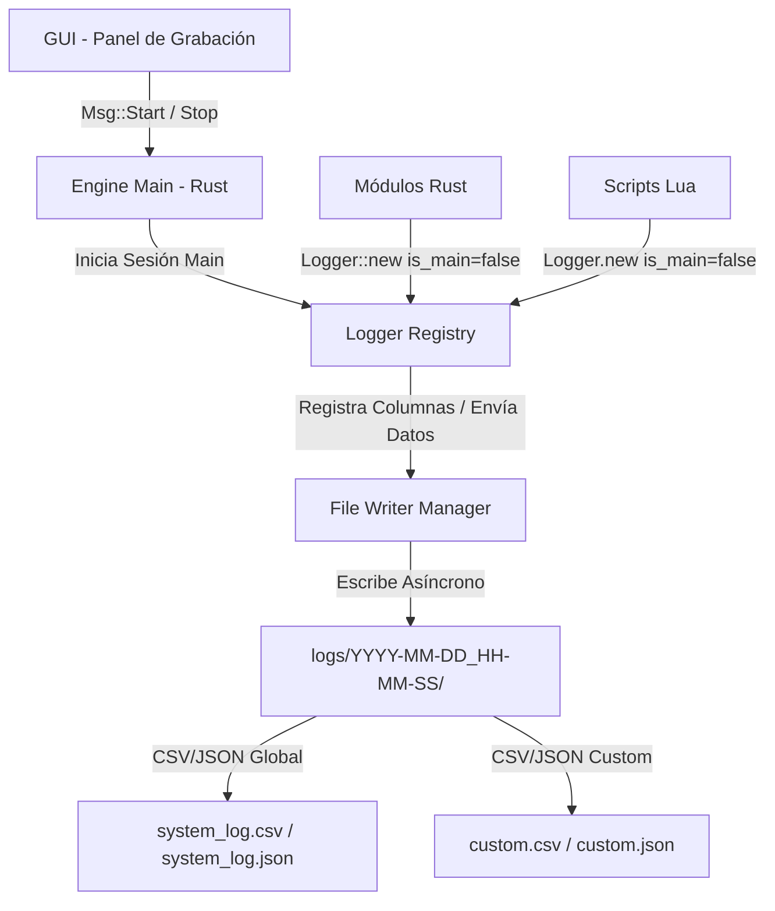

# Sistema de Registro de Variables, Telemetría y Control (Logging & Telemetry System)

* **Autor**: Marco Repetto
* **Fecha**: 17 de Julio de 2026
* **Estado**: Listo para implementar
* **Versión**: 1.2.1

---

## 2. Introducción y Contexto

El motor (*engine*) del robot Sysmic SSL procesa datos de visión y de control a alta frecuencia (60 Hz). Actualmente, el sistema cuenta con un panel de grabación en la GUI (`RecordingPanel`) y un módulo backend (`logger.rs`) para registrar datos predefinidos de los robots y el balón en archivos CSV independientes (`log_<timestamp>.csv`).

Para dotar al motor de capacidades avanzadas de depuración, sintonización de controladores y análisis modular, la versión 1.2.1 propone **unificar y extender** el registro actual en un **Sistema de Registro de Variables, Telemetría y Control**. Este sistema integra el grabador de frames existente (GUI/System Logger) con una interfaz de logging modular que permite a los desarrolladores (tanto en Rust como en Lua) registrar variables personalizadas de forma dinámica en el mismo flujo de datos o en archivos separados de la misma sesión.

---

## 3. Requerimientos Funcionales

El sistema de registro debe cumplir con los siguientes requerimientos:

* **RF-1: Unificación bajo Sesiones de Log**:
  * Cada inicio de grabación (ya sea desde el panel GUI `RecordingPanel` o mediante la instanciación de un `Logger` principal en código/Lua con `is_main = true`) creará un subdirectorio único de sesión en `logs/YYYY-MM-DD_HH-MM-SS/`.
  * Todos los archivos generados durante esa corrida (el log de frames del sistema, logs de variables de usuario, JSON de metadatos) se almacenarán en dicho subdirectorio.
  * La clase `Logger` recibirá un parámetro único `log_name`. Las rutas del archivo CSV (para variables temporales) y del archivo JSON (para reportes/metadatos) se generarán internamente de forma dinámica en base a este nombre.
* **RF-2: Logger del Sistema (Base GUI)**:
  * El grabador de frames actual de la GUI se mantendrá como el log principal del sistema (usando el nombre `"system_log"`), registrando automáticamente las variables de posición y comandos de todos los robots y el balón.
  * Se iniciará automáticamente como `is_main = true` al presionar "Start" en el panel de grabación de la GUI.
* **RF-3: Co-registro y Extensibilidad Dinámica de Columnas**:
  * Si un desarrollador instancia un `Logger` con `is_main = false` apuntando al mismo `log_name` principal (`"system_log"`), el sistema añadirá dinámicamente estas nuevas columnas al archivo CSV en tiempo de ejecución, alineando los datos en cada tick.
  * Si se escribe sobre columnas no reportadas por un sub-logger en un frame dado, el sistema debe imputar valores vacíos (celdas vacías) de manera automática.
* **RF-4: Loggers Modulares Independientes**:
  * Si se instancia un `Logger` con `is_main = true` para un nombre distinto (ej. `"pid_tuning"`), se crearán los archivos CSV y JSON en la carpeta de la sesión activa para registrar datos específicos de forma aislada.
* **RF-5: API Rust y Puente Lua**:
  * La clase `Logger` y el `LoggerRegistry` se implementarán en Rust, y se proveerá una interfaz en Lua mediante un puente de API.

---

## 4. Requerimientos No Funcionales

* **RNF-1: Rendimiento en Ciclo de Control (60 Hz)**:
  * El guardado y consolidación de datos debe ejecutarse asíncronamente en un hilo de background (File Writer Manager) para no retrasar el hilo principal de control o de la GUI.
* **RNF-2: Idempotencia y Robustez ante Recargas**:
  * Dado que la interfaz de Lua se reinicia al recargar scripts, el registro de columnas de loggers secundarios (`is_main = false`) debe ser idempotente para no duplicar cabeceras en el archivo CSV.
* **RNF-3: Tolerancia a Pérdida de Frames**:
  * En caso de pérdida de frames (dropped frames) o desincronización temporal, el sistema alineará los registros usando el `elapsed_time` del ciclo de control e imputará los campos faltantes.

---

## 5. Arquitectura y Diseño Detallado

### 5.1 Componentes del Sistema

El backend unificará la API de scripts y la GUI mediante un registro de loggers centralizado.



1. **Logger Registry (Rust)**:
   * Mantiene el estado de la sesión activa (`logs/YYYY-MM-DD_HH-MM-SS/`).
   * Registra los loggers activos y consolida dinámicamente las cabeceras de columnas para cada archivo.
   * Proporciona idempotencia: si un logger solicita columnas ya existentes tras una recarga de script Lua, no altera la cabecera.
2. **File Writer Manager (Rust)**:
   * Hilo de fondo que procesa de forma no bloqueante una cola de mensajes (`mpsc`) con los registros a guardar.
3. **Lua Logger Bridge**:
   * Expone la clase `Logger` en Lua para permitir el co-registro de variables personalizadas desde scripts.

### 5.2 Inicialización y Ciclo de Vida de una Sesión

1. **Flujo Iniciado por GUI**:
   * El usuario pulsa "Start" en el panel de grabación.
   * El motor crea el subdirectorio de sesión y levanta el `FrameRecorder` (logger del sistema) como `is_main = true` apuntando a `"system_log"` (que genera `logs/YYYY-MM-DD_HH-MM-SS/system_log.csv` y `system_log.json`).
   * Los scripts Lua en ejecución pueden conectarse a la sesión llamando a `Logger.new("system_log", ..., false)` para inyectar sus variables personalizadas en cada tick del mismo archivo.
2. **Flujo Iniciado por Script (Headless)**:
   * Un script Lua inicia el registro llamando a `Logger.new("custom", ..., true)`.
   * El motor crea la carpeta de sesión correspondiente a esa ejecución y los archivos correspondientes.

### 5.3 Diseño de la API en Rust

El módulo `src/logger/mod.rs` expondrá el registry y el nuevo struct `Logger`:

```rust
pub struct Logger {
    log_name: String,
    columns: Vec<String>,
    is_main: bool,
    sender: mpsc::Sender<LogMessage>,
}

impl Logger {
    /// Inicializa un logger dinámico a partir de un nombre de log.
    /// Genera internamente los archivos '{log_name}.csv' y '{log_name}.json'
    /// en la carpeta de la sesión actual.
    pub fn new(
        log_name: &str,
        columns: Vec<&str>,
        is_main: bool,
    ) -> Result<Self, LoggerError>;

    /// Registra valores en las columnas de este logger para el frame actual
    pub fn log_csv(&self, data: HashMap<String, f64>) -> Result<(), LoggerError>;

    /// Escribe metadatos en el reporte JSON general de la sesión
    pub fn log_json(&self, data: serde_json::Value) -> Result<(), LoggerError>;
}
```

### 5.4 Integración en Lua (Ejemplo de Co-registro)

```lua
-- El logger del sistema ("system_log") ya fue iniciado por la GUI o el script principal (is_main = true)

-- Nos acoplamos al mismo CSV del sistema para agregar métricas del control PID de orientación (is_main = false)
local pid_logger = Logger.new("system_log", {"target_theta", "theta_error", "u_omega"}, false)

function process()
    local state = get_robot_state(0)
    local target_angle = 3.1416
    
    -- Logueamos nuestras variables adicionales para este tick.
    -- Rust se encargará de acoplarlas en la misma fila del CSV junto a los datos del sistema.
    pid_logger:log_csv({
        target_theta = target_angle,
        theta_error = target_angle - state.orientation,
        u_omega = get_pid_output()
    })
end
```

### 5.5 Formato del CSV Unificado Resultante

Si la GUI/Sistema graba los datos de posición y velocidad, y el script de Lua co-registra las variables de orientación PID al mismo log principal `"system_log"`, el archivo final se guardará en `logs/YYYY-MM-DD_HH-MM-SS/system_log.csv` con este formato:

```csv
ElapsedTime,RobotID,Team,Vx_Command,Vy_Command,Angular_Command,Pos_X,Pos_Y,Orientation,Vx_Actual,Vy_Actual,target_theta,theta_error,u_omega
0.0,0,0,1.0,0.0,0.0,0.1,0.2,0.5,0.9,0.0,3.1416,2.6416,0.52
0.016,0,0,1.0,0.0,0.0,0.11,0.2,0.51,0.95,0.0,3.1416,2.6316,0.51
```

En caso de que en algún frame o tick el script de Lua no reporte datos, el backend rellenará los campos correspondientes (`target_theta`, `theta_error`, `u_omega`) con valores vacíos:

```csv
0.032,0,0,1.0,0.0,0.0,0.12,0.2,0.52,0.97,0.0,,,
```

---

## 6. Plan de Verificación y Criterios de Aceptación

1. **Compatibilidad con Panel GUI**:
   * Verificar que al pulsar "Start" en el panel `RecordingPanel` de la GUI, se cree correctamente la subcarpeta en `logs/` e inicialice la sesión con el nombre `"system_log"`.
2. **Co-registro e Idempotencia**:
   * Inicializar el log principal desde la GUI, correr un script Lua que registre 3 columnas adicionales sobre el log `"system_log"`, recargar el script Lua 5 veces seguidas, y corroborar que el archivo CSV conserve una única fila de cabeceras bien estructurada sin repeticiones.
3. **Imputación de Celdas Vacías**:
   * Detener temporalmente el logueo desde Lua a mitad de la corrida y validar que las filas resultantes en el CSV tengan comas adicionales indicando valores vacíos en las columnas personalizadas.

---

## 7. Fases de Implementación

* **Fase 1: Refactorización y Estructura de Sesiones**:
  * Adaptar el grabador de frames actual para que sea el log base principal utilizando el identificador `"system_log"`.
  * Implementar el creador de directorios temporales `logs/YYYY-MM-DD_HH-MM-SS/`.
* **Fase 2: Motor de Registro e Idempotencia**:
  * Implementar el `LoggerRegistry` y el gestor de columnas dinámicas que reescribe cabeceras e imputa valores vacíos a partir del parámetro `log_name`.
* **Fase 3: API Lua y Pruebas**:
  * Exponer la interfaz Lua y validar la sintonización de variables dinámicas sobre el archivo de logs del sistema.
