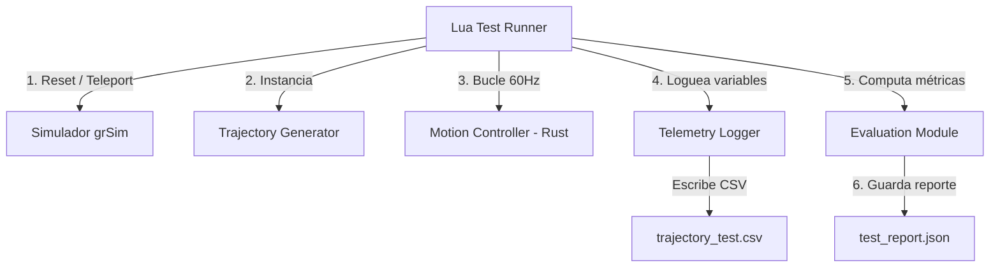

# Especificación de la Prueba de Seguimiento de Trayectorias (Trajectory Tracking Test)

* **Autor**: Marco Repetto & Antigravity
* **Fecha**: 17 de Julio de 2026
* **Estado**: Listo para implementar
* **Versión**: 1.0.1

---

## 2. Introducción y Contexto

El control de movimiento de alta precisión es un pilar fundamental para el desempeño de los robots de la categoría Small Size League (SSL). Cada vez que se realizan modificaciones en los algoritmos de control (como el controlador PID de orientación o el planificador de movimientos BangBang) o en el subsistema de evitación de obstáculos, es imperativo validar que no se introduzcan regresiones en el desempeño dinámico.

Esta especificación define un **sistema de pruebas automatizado para el seguimiento de trayectorias**. El sistema permitirá:
1. Posicionar y simular robots en trayectorias predefinidas (ej. líneas, círculos, curvas Dubins).
2. Adquirir telemetría de alta frecuencia a través del Sistema de Registro de Variables y Telemetría.
3. Evaluar el desempeño del robot calculando métricas de error estándar (MAE, RMSE, error máximo).
4. Generar reportes estructurados con veredictos automatizados (PASS/FAIL) basados en umbrales de tolerancia configurables.

---

## 3. Requerimientos Funcionales

El sistema de pruebas de trayectoria debe cumplir con los siguientes requerimientos funcionales:

* **RF-1: Definición de Trayectorias Patrón**:
  * El sistema debe proveer al menos cuatro formas geométricas de referencia para las pruebas:
    * **Línea Recta**: Para validar aceleración, frenado y control longitudinal en una dirección.
    * **Trayectoria Circular**: Para evaluar la tracción omnidireccional continua y el seguimiento de velocidad angular y centrípeta.
    * **Curva S / Dubins**: Para comprobar la transición dinámica y la estabilidad del controlador ante cambios bruscos de curvatura.
    * **Cuadrado**: Para validar respuestas transitorias en esquinas de 90° con detención y rearranque.
* **RF-2: Inicialización Automática del Escenario**:
  * Antes de comenzar cada prueba, el script debe posicionar automáticamente el robot bajo prueba en las coordenadas iniciales de la trayectoria ($x_0, y_0, \theta_0$) con velocidad cero.
  * Se utilizará el comando de teleportación del simulador (`grsim`) para garantizar un estado inicial limpio e idéntico en cada ejecución.
* **RF-3: Registro de Telemetría Sincronizado**:
  * Durante la prueba, en cada tick de control (60 Hz), el sistema debe registrar en un archivo de log específico las siguientes variables:
    * Tiempo transcurrido (`elapsed_time`).
    * Posición de referencia en el punto más cercano de la trayectoria ($x_{ref}, y_{ref}, \theta_{ref}$).
    * Posición real medida ($x_{act}, y_{act}, \theta_{act}$).
    * Desviación de posición geométrica (cross-track error, $e_p$).
    * Error de orientación relativo al punto más cercano ($e_\theta$).
    * Comandos de velocidad enviados ($v_x, v_y, \omega$).
* **RF-4: Cálculo de Métricas Estadísticas**:
  * Al finalizar el recorrido de la trayectoria, el sistema debe computar automáticamente las siguientes métricas globales, las cuales deben ser registradas en el archivo JSON del logger:
    * **MAE (Mean Absolute Error)** de desviación de posición y error de orientación.
    * **RMSE (Root Mean Squared Error)** de desviación de posición y error de orientación.
    * **Error Máximo (Max Deviation)** registrado en toda la corrida.
    * **Tiempo de Ejecución**: Duración real del recorrido comparado con la duración de referencia.
* **RF-5: Evaluación de Criterios de Aceptación**:
  * Cada prueba debe aceptar un conjunto de umbrales máximos configurables para el RMSE, MAE y Error Máximo.
  * El sistema asignará un veredicto de **PASS** si todas las métricas calculadas se encuentran por debajo de sus respectivos umbrales, o **FAIL** si alguna métrica excede el límite permitido.
* **RF-6: Reporte de Resultados**:
  * Al finalizar la prueba, el sistema exportará un reporte detallado en formato JSON (`test_report.json`) que se almacenará en la carpeta de la sesión activa (`logs/YYYY-MM-DD_HH-MM-SS/`).

---

## 4. Requerimientos No Funcionales

* **RNF-1: Ejecución a Frecuencia de Control (60 Hz)**:
  * La actualización de la trayectoria de referencia y la captura de errores dinámicos deben realizarse de forma síncrona en el bucle principal de control a 60 Hz.
* **RNF-2: Repetibilidad y Aislamiento**:
  * Los resultados de las pruebas deben ser repetibles bajo las mismas condiciones de simulación. No debe existir arrastre de inercia o colisiones residuales de ejecuciones anteriores.
* **RNF-3: Desempeño y Sobrecarga Mínima**:
  * La consolidación de métricas y la escritura de reportes JSON deben realizarse al finalizar la trayectoria de forma no bloqueante, evitando interferir con el refresco de la simulación o la interfaz gráfica del motor.

---

## 5. Arquitectura y Diseño Detallado

### 5.1 Componentes del Sistema

La funcionalidad de pruebas de trayectorias se estructurará principalmente en Lua, aprovechando el motor de scripts existente y la API de control expuesta por el backend de Rust.



1. **Trajectory Generator (`trajectory_generator.lua`)**: Genera los perfiles de posición, velocidad y orientación ideales paso a paso.
2. **Trajectory Tester (`trajectory_tester.lua`)**: Orquesta el ciclo de vida de la prueba (inicialización, bucle de ejecución, detención al llegar al objetivo).
3. **Logger / Telemetry (Rust Backend)**: Registra los datos de telemetría a alta frecuencia en formato CSV.
4. **Evaluation Module**: Computa los indicadores estadísticos al finalizar y exporta el reporte JSON.

### 5.2 Fórmulas Matemáticas de las Métricas

Para una trayectoria discretizada $\mathcal{P}_{path}$ y $N$ muestras medidas durante la corrida:

* **Error de Desviación de Posición (Cross-track Error) en el instante $i$**:
  $$e_p(i) = \min_{P \in \mathcal{P}_{path}} \sqrt{(P.x - x_{act}(i))^2 + (P.y - y_{act}(i))^2}$$

* **Punto de Referencia más cercano en el instante $i$**:
  $$P_{ref}(i) = \arg\min_{P \in \mathcal{P}_{path}} \sqrt{(P.x - x_{act}(i))^2 + (P.y - y_{act}(i))^2}$$

* **Error de Orientación en el instante $i$**:
  $$e_\theta(i) = \text{normalize\_angle}(P_{ref}(i).\theta - \theta_{act}(i))$$

* **RMSE de Desviación Posicional**:
  $$RMSE_p = \sqrt{\frac{1}{N} \sum_{i=1}^{N} e_p(i)^2}$$

* **MAE de Desviación Posicional**:
  $$MAE_p = \frac{1}{N} \sum_{i=1}^{N} e_p(i)$$

* **Error Desviación Posicional Máximo**:
  $$MaxError_p = \max_{1 \le i \le N} e_p(i)$$

---

### 5.3 API Propuesta en Lua

Se creará una clase helper `TrajectoryTester` en Lua para simplificar la escritura de scripts de prueba.

```lua
local TrajectoryTester = {}
TrajectoryTester.__index = TrajectoryTester

-- Constructor
function TrajectoryTester.new(test_name, config)
    local self = setmetatable({}, TrajectoryTester)
    self.test_name = test_name
    config = config or {}
    self.robot_id = config.robot_id or 0
    self.team = config.team or 0
    self.thresholds = config.thresholds or {
        rmse_pos = 0.05,        -- metros
        rmse_theta = 0.1,       -- radianes
        max_err_pos = 0.1,      -- metros
        max_err_theta = 0.2,    -- radianes
        arrival_tolerance = 0.05, -- metros (tolerancia para finalizar al llegar al último punto)
    }
    self.trajectory = nil
    self.samples = {}
    self.elapsed_time = 0
    self.finished = false
    self.timeout_failed = false
    self.logger = nil
    return self
end

-- Inicializa telemetría y posiciona el robot
function TrajectoryTester:start(trajectory)
    self.trajectory = trajectory
    self.samples = {}
    self.elapsed_time = 0
    self.finished = false
    self.timeout_failed = false
    
    grsim.teleport_ball(5.0, 5.0)
    local start_ref = self.trajectory.get_pose(0)
    grsim.teleport_robot(self.robot_id, self.team, start_ref.x, start_ref.y, start_ref.theta)
    
    self.logger = Logger.new(self.test_name, {
        "ref_x", "ref_y", "ref_theta",
        "act_x", "act_y", "act_theta",
        "err_pos", "err_theta"
    }, true)
end

-- Se ejecuta en cada frame/tick del engine (60 Hz)
function TrajectoryTester:update()
    if self.finished then return true end
    
    local state = get_robot_state(self.robot_id, self.team)
    if not state or not state.active then return false end
    
    self.elapsed_time = self.elapsed_time + (1.0 / 60.0)
    local ref = self.trajectory.get_pose(self.elapsed_time)
    
    local dx = ref.x - state.x
    local dy = ref.y - state.y
    local err_pos = math.sqrt(dx * dx + dy * dy)
    local err_theta = math.abs(normalize_angle(ref.theta - state.orientation))
    
    self.logger:log_csv({
        ref_x = ref.x, ref_y = ref.y, ref_theta = ref.theta,
        act_x = state.x, act_y = state.y, act_theta = state.orientation,
        err_pos = err_pos, err_theta = err_theta
    })
    
    table.insert(self.samples, { err_pos = err_pos, err_theta = err_theta })
    
    move_to(self.robot_id, self.team, {x = ref.x, y = ref.y})
    
    local face_pt = { x = state.x + math.cos(ref.theta), y = state.y + math.sin(ref.theta) }
    face_to(self.robot_id, self.team, face_pt)
    
    -- Evaluar fin de prueba (Llegada al destino con tolerancia o Timeout de seguridad tras transcurrir la duración total)
    local time_elapsed_fully = self.elapsed_time >= self.trajectory.total_time
    
    if time_elapsed_fully then
        local final_ref = self.trajectory.get_pose(self.trajectory.total_time)
        local dx_final = final_ref.x - state.x
        local dy_final = final_ref.y - state.y
        local dist_to_final = math.sqrt(dx_final * dx_final + dy_final * dy_final)
        
        local arrival_tol = self.thresholds.arrival_tolerance or 0.05
        local arrived = dist_to_final <= arrival_tol
        local timeout_exceeded = self.elapsed_time >= (self.trajectory.total_time + 5.0)
        
        if arrived or timeout_exceeded then
            self.finished = true
            if timeout_exceeded and not arrived then
                self.timeout_failed = true
            end
            self:evaluate()
            return true
        end
    end
    
    return false
end

-- Computa métricas finales y genera veredicto
function TrajectoryTester:evaluate()
    -- (Cálculo estadístico de RMSE, MAE, Max Error y exportación a JSON de reporte)
end
```

### 5.4 Formato del Reporte JSON (`test_report.json`)

```json
{
  "test_name": "trajectory_test_circle",
  "timestamp": "2026-07-17T17:30:00Z",
  "verdict": "PASS",
  "metrics": {
    "samples": 360,
    "rmse_position": 0.0245,
    "mae_position": 0.0182,
    "max_error_position": 0.0489,
    "rmse_orientation": 0.0312,
    "max_error_orientation": 0.0650,
    "execution_time_seconds": 6.0
  },
  "thresholds": {
    "rmse_pos": 0.05,
    "rmse_theta": 0.1,
    "max_err_pos": 0.1
  }
}
```

---

## 6. Plan de Verificación y Criterios de Aceptación

Para asegurar el correcto funcionamiento del sistema de pruebas de trayectorias, se deben cumplir los siguientes criterios de aceptación:

1. **Generación Correcta de Referencias**:
   * Validar mediante pruebas unitarias en Lua que el generador de trayectorias (`trajectory_generator.lua`) produzca las coordenadas geométricas deseadas sin saltos de discontinuidad (excepto transiciones en esquinas de 90° si el perfil lo requiere).
2. **Correctitud Matemática de Métricas**:
   * Crear un set de datos de prueba sintético (con errores de posición fijos y variables conocidos) y validar que las fórmulas de cálculo de MAE, RMSE y Máximo Desvío en Lua retornen los valores exactos esperados.
3. **Escritura del Reporte**:
   * Verificar que al finalizar la trayectoria, se genere el archivo JSON en el directorio de log activo con la estructura correcta del esquema y los valores precisos calculados.
4. **Veredicto PASS/FAIL Correcto**:
   * Realizar una simulación donde se alteren deliberadamente las ganancias del controlador (ej. subiendo el error dinámico por encima de los límites) y verificar que el veredicto del reporte cambie de `PASS` a `FAIL`.

---

## 7. Fases de Implementación

* **Fase 1: Módulo de Trayectorias (Lua)**:
  * Crear `trajectory_generator.lua` implementando la generación paso a paso de líneas, círculos y cuadrados.
* **Fase 2: Módulo Tester e Integración con Telemetría (Lua)**:
  * Desarrollar `trajectory_tester.lua` con la clase `TrajectoryTester` para encapsular la inicialización de logs, actualización por tick y recolección de muestras.
* **Fase 3: Módulo de Evaluación y Reportes (Lua)**:
  * Implementar las operaciones de cálculo estadístico (RMSE, MAE, Max) al concluir el test y la serialización a JSON mediante el logger.
* **Fase 4: Suite de Pruebas Automatizadas (Lua/Simulador)**:
  * Crear un script global `run_trajectory_tests.lua` que ejecute consecutivamente las pruebas lineal, circular y cuadrada, emitiendo un reporte final consolidado para el desarrollador.
